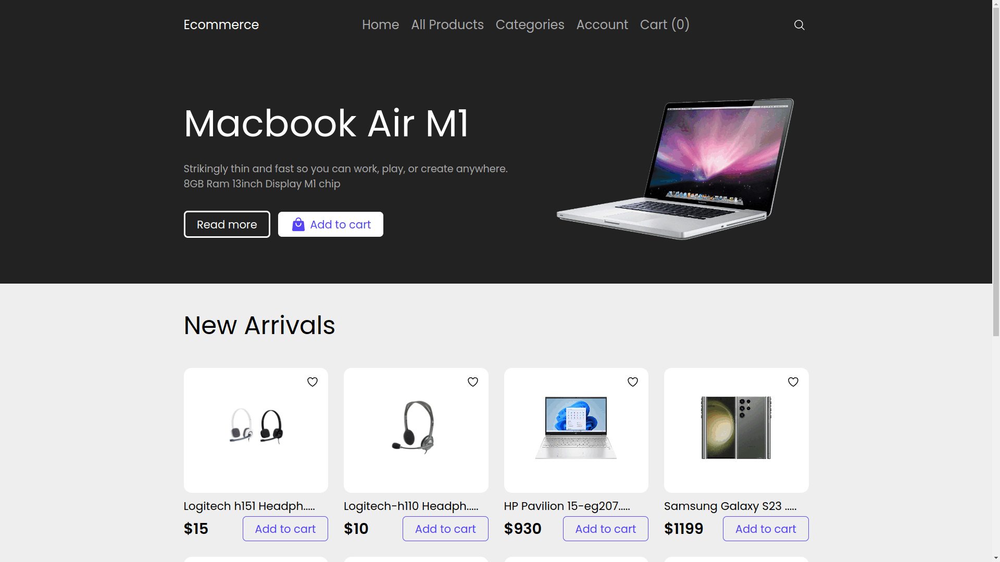
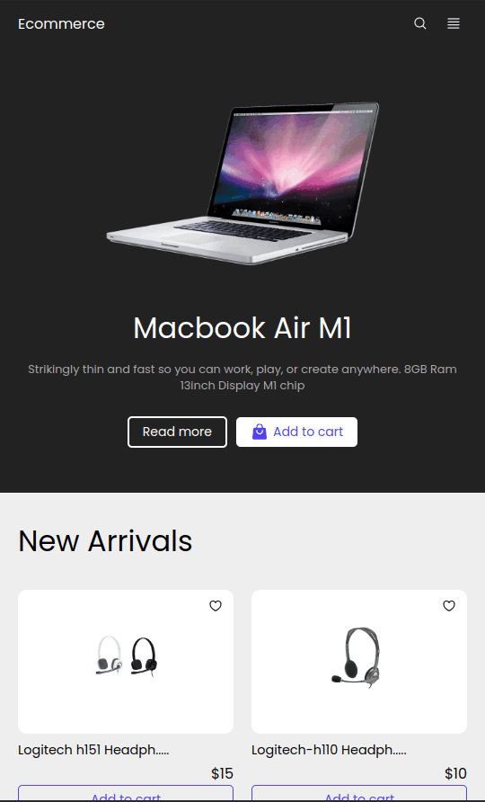

## Technology Used

* Next.js 13
* StyledComponent
* NextAuth
* AWS S3
* MongoDB
* Stripe(For payment)

## Live Website

Link: https://ecommerce-front-next-js.vercel.app/

[N.B. The website might seem slower but it is not. When I created the MongoDB database, I used Singapore as the location due to its closeness to my area for faster connectivity. But the Vercel server is in the US. Which is causing this delay]

## How the website looks

|      Desktop Mode<br />      |
| :-------------------------------------------------------------------------: |
| **Mobile Device**<br /> |

This is a [Next.js](https://nextjs.org/) project bootstrapped with [`create-next-app`](https://github.com/vercel/next.js/tree/canary/packages/create-next-app).

## Getting Started

First, run the development server:

```bash
npm run dev
# or
yarn dev
# or
pnpm dev
```

Open [http://localhost:3000](http://localhost:3000) with your browser to see the result.
